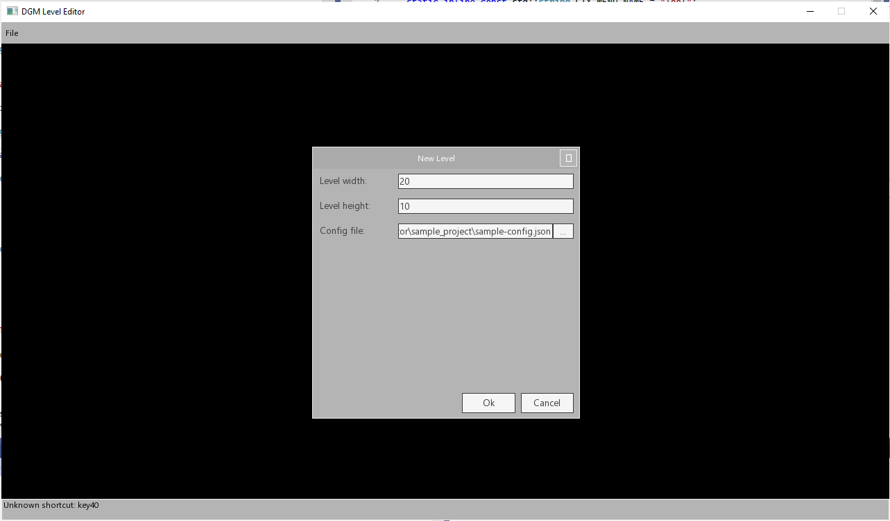

# DGM Level Editor

This is an editor meant for editing 2D tile based levels stored in [.lvd binary file format](https://github.com/nerudaj/dsh/tree/master/Libraries/LevelD). It complements development in [dgm-sdk](https://github.com/nerudaj/dgm-sdk) as .lvd is by default linked to that framework.

## Dependencies

 * cmake 3.23.2
 * MSVC 17.4 an newer

All C++ dependencies are downloaded automatically when configuring.

## Building the project

Simplest way is to have cmake in your PATH and simply running `MakeRelease.bat`. If you just need the MSVC solution, follow these steps:

```sh
mkdir vsbuild
cd vsbuild
cmake -DDISABLE_BENCHMARKS=ON -DCACHE_THIRD_PARTY=ON ..
```

This will configure your project and will create a solution project inside `vsbuild` folder.

## Demo editing project

Before you can start making any levels, you need to compile assets from your game and create a configuration file. However, this repo provides a simple sample project (only assets and config file) so you can simply test out it works. You can find it in the `sample_project` folder. Rest of this guide will use the sample project. You can read how to create your own config in [this guide]().

### First launch

After first launch, click File -> New and point the New level dialog to `sample_project\sample-config.json`:



Confirm your selection.

TODO: rest