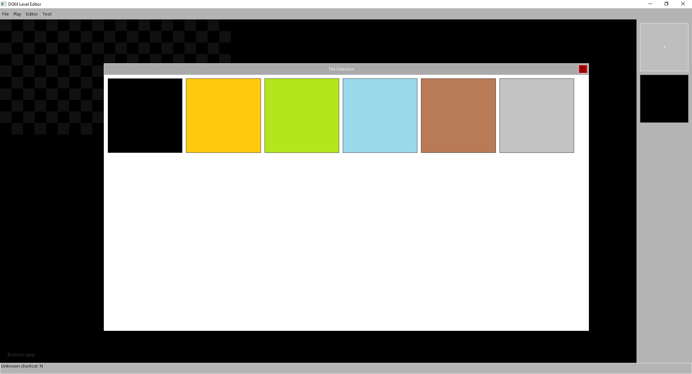
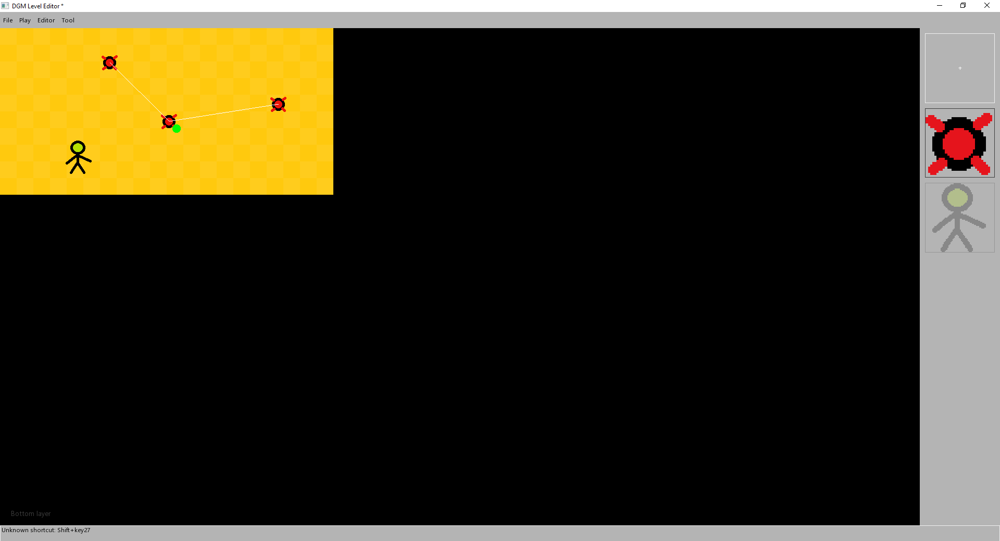
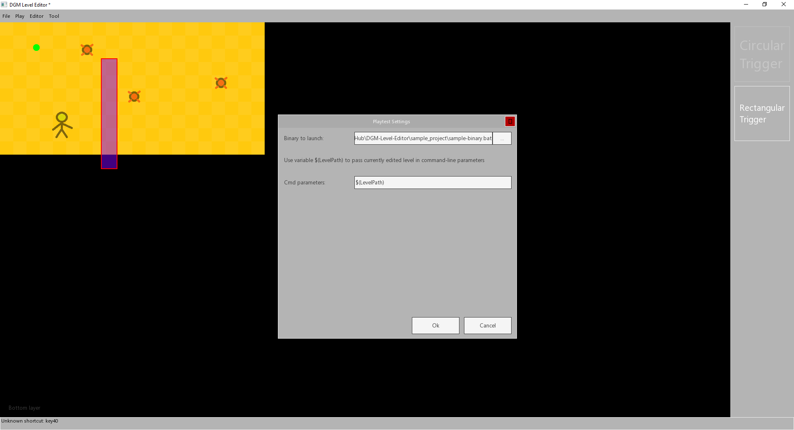

[](https://github.com/nerudaj/DGM-Level-Editor/actions/workflows/continuous-integration.yml)

# DGM Level Editor

This is an editor meant for editing 2D tile based levels stored in [.lvd binary file format](https://github.com/nerudaj/dsh/tree/master/Libraries/LevelD). It complements development in [dgm-sdk](https://github.com/nerudaj/dgm-sdk) as .lvd is by default linked to that framework.

## Dependencies

 * cmake 3.23.2
 * MSVC 17.4 an newer

All C++ dependencies are downloaded automatically when configuring.

## Building the project

Simplest way is to have cmake in your PATH and simply running `MakeRelease.bat`. If you just need the MSVC solution, follow these steps:

```sh
mkdir vsbuild
cd vsbuild
cmake -DDISABLE_BENCHMARKS=ON -DCACHE_THIRD_PARTY=ON ..
```

This will configure your project and will create a solution project inside `vsbuild` folder.

## Demo editing project

Before you can start making any levels, you need to compile assets from your game and create a configuration file. However, this repo provides a simple sample project (only assets and config file) so you can simply test out it works. You can find it in the `sample_project` folder. Rest of this guide will use the sample project. You can read how to create your own config in [this guide](docs/writing_config.md).

### First launch

After first launch, click File -> New and point the New level dialog to `sample_project\sample-config.json`:


Confirm your selection. This will create a default level of size 20 by 10 tiles. Click the + icon in the right sidebar to access tile selection, pick a tile and start drawing.



Click the Tool menu to access specific modes of operation for currently selected mode (there is a Mesh mode, Item mode and Triggers mode). You can swap the active mode under Editor menu. You can also resize the level or swap active layers (there are three - Bottom, Middle and Upper).


Left click usually places an object (tile/trigger/...), drag moves it around, clicking an existing object will select it (so you can drag multiple objects around). Right clicking will display properties of a given thing, so you can manually adjust its metadata (and your game can then interpret them to as need). Make sure you are using a correct mode before accessing appropriate properties (you can only right-click a tile in a Mesh mode for example).


Assigning multiple things a same tag will link them together (so you can link a trigger to a bomb so it is detonated when player crosses the trigger).



Edit the preferences under Play menu and you can then launch your game with the current level directly from the editor using F5.


